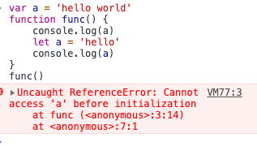

## 暂时性死区

### 现象

先看下面的代码

```javascript
var a = 'hello world'
function func() {
	console.log(a)
	let a = 'hello'
	console.log(a)
}
func()
```



最后出现`ReferenceError`

这种现象的原因就是let和const的**暂时性死区** (temporal dead zone，简称TDZ)

**tips**

> 不成功的RHS引用会导致抛出ReferenceError异常。不成功的LHS引用会导致自动隐式创建一个全局变量（非严格模式），或者抛出ReferenceError异常

## 作用域

es3规范中、try/catch中的catch会创建作用域。所以在不使用es6的情况下还可以使用这样的方式创建作用域

```javascript
var a = 15;
try {
  throw 'hello world'
} catch(a) {
  console.log(a)
}
console.log(a);
```

输出

```
hello world
15
```

## var、函数的提升

函数和var声明的变量都会被提升，函数先被提升，然后才是变量

```javascript
a = 10;
console.log(a);  // 10
var a; 
```


