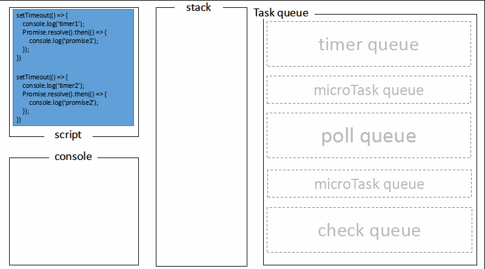

> 上次面试问到node event loop，不太熟悉下去看了一下
>
> 最近学习node event loop的时候，发现自己的结果与网上很多不一样，原因是我现在使用的node v12与以前的版本有细微的差别

为什么我看的博客都没有提到！！！！！！！！！！！！！！！！！！！！！！！！！疑问了好久，最后还是靠万能的google

感谢[这篇文章](https://blog.insiderattack.net/new-changes-to-timers-and-microtasks-from-node-v11-0-0-and-above-68d112743eb3)

# Node.js v11以上 vs Chrome

**在老版本中，分别在浏览器和Chrome运行下面的代码会得到不同的结果**

```javascript
setTimeout(() => console.log('timeout1'));
setTimeout(() => {
    console.log('timeout2')
    Promise.resolve().then(() => console.log('promise resolve'))
});
setTimeout(() => console.log('timeout3'));
setTimeout(() => console.log('timeout4'));
```

- Chrome

  ```
  timeout1
  timeout2
  promise resolve
  timeout3
  timeout4
  ```

- Node

  ```
  timeout1
  timeout2
  timeout3
  timeout4
  promise resolve 
  ```

### 之后，在一番[激烈讨论♂](https://github.com/nodejs/node/issues/22257)后，Node.js v11.0.0添加了新特性（修复）,以保持和浏览器的行为一致。

在Node v11之后，microtask会在每一个`setTimeout、setImmediate`的callbacks后运行，即使队列还没有清空。目的是为了和浏览器行为保持一致，提升浏览器代码在node中的可用性。


### Node.js v11和Node.js v10对比

```javascript
setImmediate(() => console.log('timeout1'));
setImmediate(() => {
    console.log('timeout2')
    process.nextTick(() => console.log('next tick'))
});
setImmediate(() => console.log('timeout3'));
setImmediate(() => console.log('timeout4'));
```


# Node.js 与浏览器的 Event Loop 差异 (以下内容只适用于Node 11版本以前)

回顾上一篇，浏览器环境下，`microtask`的任务队列是每个`macrotask`执行完之后执行。

crotask.png)

而在Node.js中，`microtask`会在事件循环的各个阶段之间执行，也就是一个阶段执行完毕，就会去执行`microtask`队列的任务

crotask-in-node.png)

- **timers 阶段**：这个阶段执行timer（`setTimeout`、`setInterval`）的回调
- **I/O callbacks 阶段**：执行一些系统调用错误，比如网络通信的错误回调
- **idle, prepare 阶段**：仅node内部使用
- **poll 阶段**：获取新的I/O事件, 适当的条件下node将阻塞在这里
- **check 阶段**：执行 `setImmediate()` 的回调
- **close callbacks 阶段**：执行 `socket` 的 `close` 事件回调

我们重点看`timers`、`poll`、`check`这3个阶段就好，因为日常开发中的绝大部分异步任务都是在这3个阶段处理的。

## Nodejs

以下方式为以前版本的node



## 浏览器


