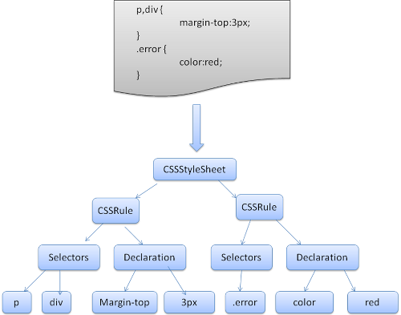
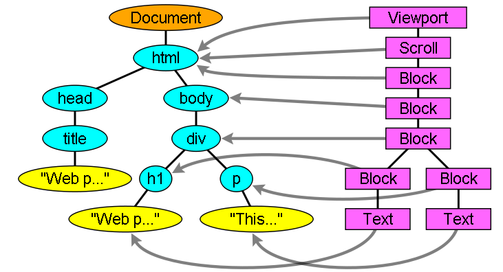

https://juejin.im/post/5b88ddca6fb9a019c7717096

# Css、js加载会不会造成阻塞

1. css加载不会阻塞DOM树的解析
2. css加载会阻塞DOM树的渲染
3. css加载会阻塞后面js语句的执行
4. js阻塞DOM解析
5. **遇到`<script></script>`标签会触发页面渲染，而页面渲染依赖css，所以才有第3条**

因此，为了避免让用户看到长时间的白屏时间，我们应该尽可能的提高css加载速度，比如可以使用以下几种方法:

1. 使用CDN(因为CDN会根据你的网络状况，替你挑选最近的一个具有缓存内容的节点为你提供资源，因此可以减少加载时间)
2. 对css进行压缩(可以用很多打包工具，比如webpack,gulp等，也可以通过开启gzip压缩)
3. 合理的使用缓存(设置cache-control,expires,以及E-tag都是不错的，不过要注意一个问题，就是文件更新后，你要避免缓存而带来的影响。其中一个解决防范是在文件名字后面加一个版本号)
4. 减少http请求数，将多个css文件合并，或者是干脆直接写成内联样式(内联样式的一个缺点就是不能缓存)


https://segmentfault.com/a/1190000010298038

# 浏览器渲染主要流程

不同的浏览器内核不同，所以渲染过程不太一样。

WebKit 主流程


Mozilla 的 Gecko 呈现引擎主流程


由上面两张图可以看出，虽然主流浏览器渲染过程叫法有区别，但是主要流程还是相同的。
Gecko 将视觉格式化元素组成的树称为“框架树”。每个元素都是一个框架。WebKit 使用的术语是“呈现树”，它由“呈现对象”组成。对于元素的放置，WebKit 使用的术语是“布局”，而 Gecko 称之为“重排”。对于连接 DOM 节点和可视化信息从而创建呈现树的过程，WebKit 使用的术语是“附加”。

**所以可以分析出基本过程：**

1. HTML解析出DOM Tree
2. CSS解析出Style Rules
3. 将二者关联生成Render Tree
4. Layout 根据Render Tree计算每个节点的信息
5. Painting 根据计算好的信息绘制整个页面

## HTML解析

HTML Parser的任务是将HTML标记解析成DOM Tree

一段HTML

```
<html>
<head>
    <title>Web page parsing</title>
</head>
<body>
    <div>
        <h1>Web page parsing</h1>
        <p>This is an example Web page.</p>
    </div>
</body>
</html>
```

经过解析之后的DOM Tree差不多就是


## CSS解析

CSS Parser将CSS解析成Style Rules，Style Rules也叫CSSOM（CSS Object Model）。
StyleRules也是一个树形结构，根据CSS文件整理出来的类似DOM Tree的树形结构：



## 脚本处理

浏览器解析文档，当遇到``标签的时候，会立即解析脚本，停止解析文档（因为JS可能会改动DOM和CSS，所以继续解析会造成浪费）。
如果脚本是外部的，会等待脚本下载完毕，再继续解析文档。现在可以在script标签上增加属性 `defer`或者`async`。
脚本解析会将脚本中改变DOM和CSS的地方分别解析出来，追加到DOM Tree和Style Rules上。

## 呈现树（Render Tree）

Render Tree的构建其实就是DOM Tree和CSSOM Attach的过程。
呈现器是和 DOM 元素相对应的，但并非一一对应。Render Tree实际上就是一个计算好样式，与HTML对应的（包括哪些显示，那些不显示）的Tree。

> 在 WebKit 中，解析样式和创建呈现器的过程称为“附加”。每个 DOM 节点都有一个“attach”方法。附加是同步进行的，将节点插入 DOM 树需要调用新的节点“attach”方法。



## 布局Layout

创建渲染树后，下一步就是布局（Layout）,或者叫回流（reflow,relayout），这个过程就是通过渲染树中渲染对象的信息，计算出每一个渲染对象的位置和尺寸，将其安置在浏览器窗口的正确位置，而有些时候我们会在文档布局完成后对DOM进行修改，这时候可能需要重新进行布局，也可称其为回流，本质上还是一个布局的过程，每一个渲染对象都有一个布局或者回流方法，实现其布局或回流。

## 绘制（Painting）

在绘制阶段，系统会遍历呈现树，并调用呈现器的“paint”方法，将呈现器的内容显示在屏幕上。绘制工作是使用用户界面基础组件完成的。

CSS2 规范定义了绘制流程的顺序。绘制的顺序其实就是元素进入堆栈样式上下文的顺序。这些堆栈会从后往前绘制，因此这样的顺序会影响绘制。块呈现器的堆栈顺序如下：

1. 背景颜色
2. 背景图片
3. 边框
4. 子代
5. 轮廓